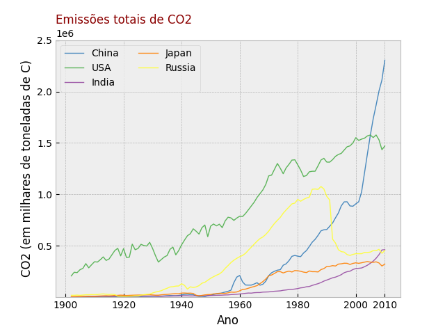
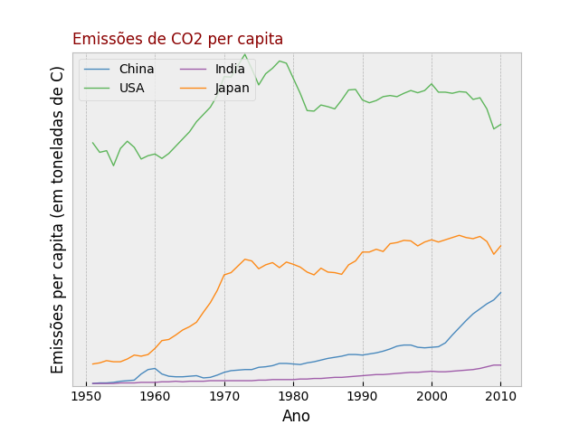

## Projeto Guiado - Curso de Análise de Dados em Python - Zênite Serena - Emissão de CO2

### Contextualização e Resumo da Análise

Projeto Guiado que fez parte do bootcamp "Python: Fundamentos e Análise de Dados" da [{reprograma}](https://reprograma.com.br/curso-python/), realizado no segundo semestre de 2023.

[Repositório no GitHub](https://github.com/zenite-serena/Emissao-de-CO2)

A presente análise exploratória se voltou para a emissão de Dióxido de Carbono (CO2) a nível mundial, entendendo o seu papel no aquecimento global, um dos principais fatores por trás da mudança climática.

O trabalho envolveu o tratamento e análise de dados disponíveis no site [Ess Dive](https://data.ess-dive.lbl.gov/view/doi%3A10.15485%2F1712447), localizado através da plataforma Kaggle.

O intuito dessa análise foi comparar as emissões de dióxido de carbono entre grandes emissores e gerar gráficos que permitam a fácil visualização desses dados.

O resultado chama atenção ao que têm apresentado inúmeras organizações como o IPCC (Intergovernmental Panel on Climate Change) e a NASA (National Aeronautics and Space Administration), que alertam para os perigos da mudança climática impulsionada pela queima de combustíveis fósseis e o consequente agravamento do efeito estufa.

Nossos gráficos permitem visualizar que, dentre quatro dos maiores poluidores do mundo, em uma série histórica, são dois dos países do Norte Global que têm o maior índice de emissão de CO2 per capita. Dito de outra forma, os países do Sul Global sofrerão os devastadores efeitos de um problema que, historicamente, não é de sua responsabilidade.

### Descrição da base de dados

O banco de dados utilizado é uma série temporal de emissões de Dióxido de Carbono (CO2) vindas de combustão de combustíveis fósseis e produção de cimento. Estão incluídas estimativas de várias nações, começando em 1751, e incluem emissões de consumo de combustíveis sólidos, líquidos e gasosos, produção de cimento e combustão de gás em “flares” industriais. As estimativas foram geradas a partir do banco de dados das Estatísticas de Energia das Nações Unidas e as estatísticas de pesquisas geológicas dos Estado Unidos acerca da produção de cimento.

Neste pacote de dados é possível encontrar planilhas (.csv) de estimativas globais e nacionais de emissão de CO2 assim como arquivos de texto com o ranqueamento de emissão por país e per capita para o respectivo ano.

### Tratamento

Para o tratamento de dados foram criados subsets baseados em uma lista de maiores emissores de CO2, presente no conjunto de arquivos original.

Foi criado um range para selecionar anos (de 1902 a 2010 e de 1951 a 2010) para melhor aproveitar os dados presentes.

Foi preciso tratar alguns dados de tipo object para que se transformassem em tipo float.

### Conclusão

Como aponta a reportagem "Analysis: Which countries are historically responsible for climate change?", o aquecimento global e consequente mudança climática assumem contornos condizentes com desigualdades globais de um problema compartilhado. Nossos gráficos permitem visualizar que, dentre quatro dos maiores poluidores do mundo, em uma série histórica são dois dos países do Norte Global que têm o maior índice de emissão de CO2 per capita. Dito de outra forma, os países do Sul Global sofrerão os devastadores efeitos de um problema que, historicamente, não é de sua responsabilidade.

[Analysis: Which countries are historically responsible for climate change?](https://www.carbonbrief.org/analysis-which-countries-are-historically-responsible-for-climate-change/)

Considerando que a emissão de CO2 está intimamente ligada à industrialização, é possível perceber os contornos destes processos nos países selecionados. Por exemplo, é possível visualizar nos anos que antecedem a virada para a década de 1960 um crescimento acentuado na curva da China, possivelmente ligada aos processos de industrialização do "Grande Salto para Frente", associado com o governo de Mao Tsé-Tung. Também é possível observar, nos dados relativos à USSR (e posteriormente, Federação Russa), uma queda acentuada a partir da década de 1990, o que parece corresponder à queda do regime soviético.

### Fonte dos dados

[Ess Dive](https://data.ess-dive.lbl.gov/view/doi%3A10.15485%2F1712447)
